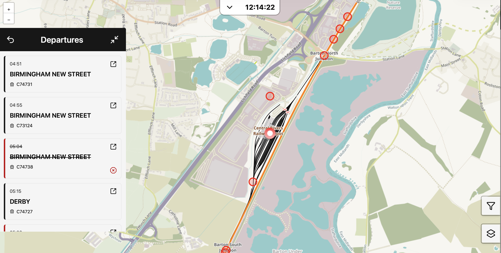
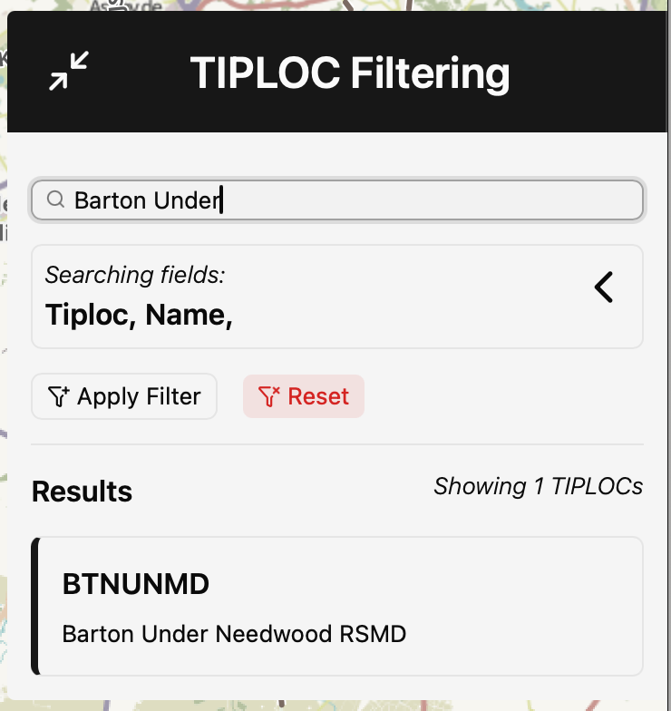
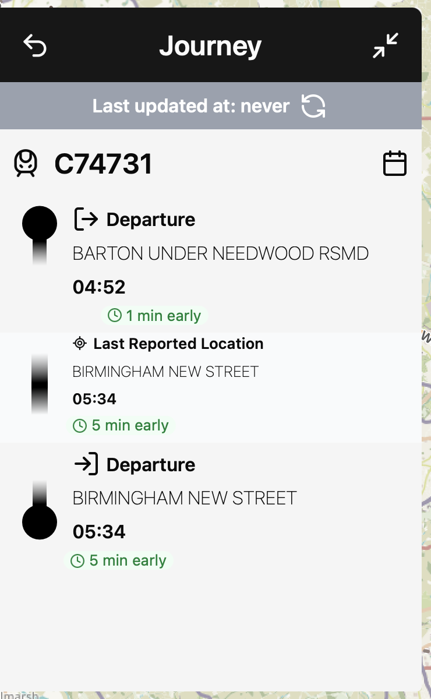
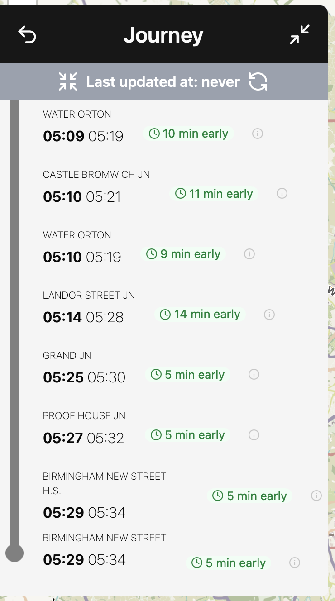
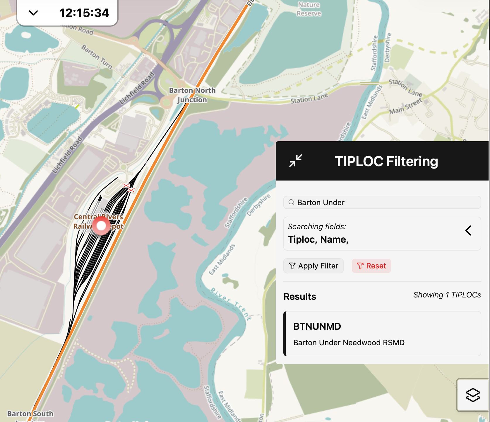
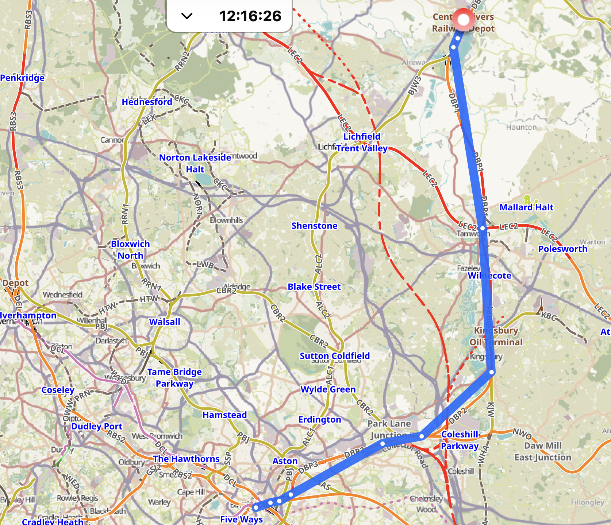

# Project Velodrome


## Developers

|Contributors list|
|----|
|Reuben Waring|
|Conor Sweeney stoppard|
|George Grosvenor|
|Amaryllis Richmond|

## Project goal

Our goal, outlined by our client VELOCITI was to build a system for visualising and interacting with TIPLOC data via an integrated API. 

Our project enables users to select a TIPLOC to access the timetables, displaying departure times and journey details in a sidebar whilst also plotting the route on a map for an accurate visual representation.

## How to run locally

To run the project locally from clean install, open terminal and input;

```bash
npm install
```

The development server may then sucessfully start and run;

```bash
npm run dev
```

The server will then be accessible via <http://localhost:3000>.

> [!NOTE]
> The server runs on port 3000 by default. To run the program on a different port, [arguments need to be passed through to vite.](https://vite.dev/guide/cli)
> ```bash
> npm run dev -- --port 4000
> ```


## Features list

|Feature|Description|
|----|----|
|Line rendering| Plots a line between the Tiplocs to represent the journey.|
|TIPLOC Filtering| A filtering system that allows users to filter the map by TIPLOC name.|
|Timetable display| A menu which displays the timetable and journey of a train once selected.|
|Information display| When a TIPLOC is selected, the relevant information such as Station number, will be displayed to the user.|
|Departures display| When the departures button is selected on a TIPLOC, it will display all relevant departures. |
|Live clock| A clock system which displays the live time. |

## Gallery 



||||
|---|---|---|

|||
|---|---|

## Libraries Used

A web based tool based on [react](https://react.dev/reference/react) and [leaflet](https://leafletjs.com/reference.html) for visualising train data on the UK rail network.

||
|-----|
|[Vite](https://vite.dev/)|
|[ESLint](https://eslint.org/)|
|[React](https://react.dev/)|
|[LeafletJS](https://leafletjs.com/)|
|[React Leaflet](https://react-leaflet.js.org/)|
|[Shadcn](https://ui.shadcn.com/)|
|[Typescript](https://www.typescriptlang.org/)|

## Important miscellaneous links 

||
|----|
|[Docs Repo](https://github.com/reubwa/velodrome-docs)|
|[Tiploc Analysis Tool](https://github.com/reubwa/JSONist)|
[Map identifiers](https://www.openrailwaymap.org)

